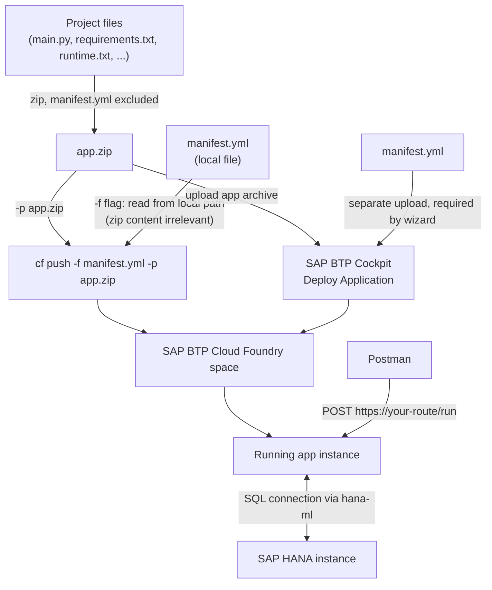

# SAP BTP Cloud Foundry ↔ SAP HANA Integration (Example Service)

A minimal example service that demonstrates how to connect an app running on **SAP BTP Cloud Foundry** to an **SAP HANA** database using [hana-ml](https://pypi.org/project/hana-ml/). It exposes a single HTTP endpoint that opens a HANA connection and writes a small example DataFrame into a table, so the whole connectivity path (App → BTP → HANA) can be verified end-to-end, e.g. via Postman.

## What it does

- `POST` route `/run` triggers `get_hana_connection()`, which builds a `ConnectionContext` from environment variables (`HANA_HOST`, `HANA_PORT`, `HANA_USER`, `HANA_PASSWORD`).
- The example data (`order_id`, `customer_name`, `amount_eur`) is loaded into a pandas DataFrame and written to a table called `SALES_ORDERS` in HANA via `write_dataframe_to_hana()`.
- On success, the endpoint returns a simple confirmation string — useful as a smoke test for the BTP → HANA connection.

## Project structure

```
.
├── main.py           # Flask app + HANA connection/upload logic
├── manifest.yml       # Cloud Foundry deployment manifest
├── requirements.txt   # Python dependencies (flask, hana-ml, python-dotenv)
├── runtime.txt         # Python buildpack version
└── .env                # Local-only environment variables (never commit real credentials)
```

## Prerequisites

- Python 3.14 (see `runtime.txt`)
- Access to an SAP HANA instance (host, port, user, password)
- [Cloud Foundry CLI](https://docs.cloudfoundry.org/cf-cli/install-go-cli.html) (`cf`) with access to an SAP BTP Cloud Foundry space
- [Postman](https://www.postman.com/) (or any HTTP client) for testing the deployed service

## Configuration

Environment variables required by the app:

| Variable        | Description                  |
|-----------------|-------------------------------|
| `HANA_HOST`     | HANA instance hostname        |
| `HANA_PORT`     | HANA SQL port (e.g. 443)      |
| `HANA_USER`     | HANA database user            |
| `HANA_PASSWORD` | HANA database user password   |

**Locally**, these are loaded from a `.env` file via `python-dotenv`:

```
hana_host = your_hana_host
hana_port = your_hana_port
hana_user = your_hana_user
hana_password = your_hana_password
```

> ⚠️ `.env` is only meant for local development. Do not commit real credentials — add `.env` to `.gitignore` and, on Cloud Foundry, set the values as app environment variables instead (see below).

## Running locally

```bash
pip install -r requirements.txt
python main.py
```

The app starts on `http://localhost:3000` (or the port set via the `PORT` environment variable).

## Deploying to SAP BTP Cloud Foundry

In both deployment options below, the app bits (source code) and the `manifest.yml` are handled separately: everything **except** `manifest.yml` is zipped up, and the manifest is supplied on its own alongside the zip. You can do this either via the Cloud Foundry CLI or directly in the SAP BTP cockpit (browser), without installing the CLI.

> ℹ️ Excluding `manifest.yml` from the zip is **required for the cockpit's "Deploy Application" wizard** (Option B) — it expects the app archive and the manifest as two separate uploads and won't process a manifest bundled inside the zip. For the **CLI** (Option A), it's not strictly necessary: `cf push -f manifest.yml -p app.zip` always reads the manifest from the local path given via `-f`, regardless of whether a copy of it also sits inside the zip. We exclude it in both cases anyway, to keep the same zip and workflow usable for either option.



### Option A: Deploy via Cloud Foundry CLI

1. **Log in to your SAP BTP Cloud Foundry space:**
   ```bash
   cf login -a https://api.cf.<region>.hana.ondemand.com
   ```

2. **Zip the project, excluding `manifest.yml`** (not strictly required for the CLI, but keeps the zip identical to the one used in Option B):
   ```bash
   zip -r app.zip . -x "manifest.yml" -x ".env" -x ".git/*"
   ```

3. **Set your route** in `manifest.yml` (replace `<your_domain>` with your actual Cloud Foundry domain).

4. **Push the app**, passing the zip and the manifest separately:
   ```bash
   cf push -f manifest.yml -p app.zip
   ```

5. **Set the HANA credentials as app environment variables** (instead of relying on `.env`, which is not part of the zip):
   ```bash
   cf set-env sap-btp-cf-hana-integration HANA_HOST your_hana_host
   cf set-env sap-btp-cf-hana-integration HANA_PORT your_hana_port
   cf set-env sap-btp-cf-hana-integration HANA_USER your_hana_user
   cf set-env sap-btp-cf-hana-integration HANA_PASSWORD your_hana_password
   cf restage sap-btp-cf-hana-integration
   ```

### Option B: Deploy via the SAP BTP Cockpit (browser, no CLI needed)

1. Zip the project the same way as in Option A, excluding `manifest.yml` (and `.env`).
2. In the SAP BTP cockpit, navigate to your subaccount → **Cloud Foundry space** → **Applications**.
3. Choose **Deploy Application**.
4. Upload the zipped app bits (`app.zip`) as the application archive.
5. Upload `manifest.yml` separately when prompted for the manifest.
6. Confirm the deployment; the cockpit pushes the app to the space the same way `cf push` would.
7. Under the application's **User-Provided Variables** tab, set `HANA_HOST`, `HANA_PORT`, `HANA_USER`, and `HANA_PASSWORD`, then restart the app for the changes to take effect.

For background on the general SAP BTP Cloud Foundry environment and deployment model, see the official documentation: [SAP Help Portal – Cloud Foundry Environment](https://help.sap.com/docs/btp/sap-business-technology-platform/cloud-foundry-environment) and the [Cloud Foundry `cf push` docs](https://docs.cloudfoundry.org/devguide/push.html).

## Testing the service with Postman

Once deployed, the app is reachable at the route defined in `manifest.yml`, e.g.:

```
https://sap-btp-cf-hana-integration.<your_domain>
```

1. Open Postman and create a new request.
2. Set the method to `POST` and the URL to:
   ```
   https://sap-btp-cf-hana-integration.<your_domain>/run
   ```
3. No request body or headers are required.
4. Send the request. A successful response returns:
   ```
   Connected to HANA database successfully!
   ```
5. Verify in your HANA instance (e.g. via SAP HANA Database Explorer) that the `SALES_ORDERS` table was created and populated with the example rows.

If the request fails, check:
- `cf logs sap-btp-cf-hana-integration --recent` for stack traces
- That `HANA_HOST` / `HANA_PORT` / `HANA_USER` / `HANA_PASSWORD` are correctly set via `cf env sap-btp-cf-hana-integration`
- Network/connectivity (e.g. HANA Cloud instance allowlisting the Cloud Foundry outbound IP range, or an active Cloud Connector setup for on-premise HANA)
